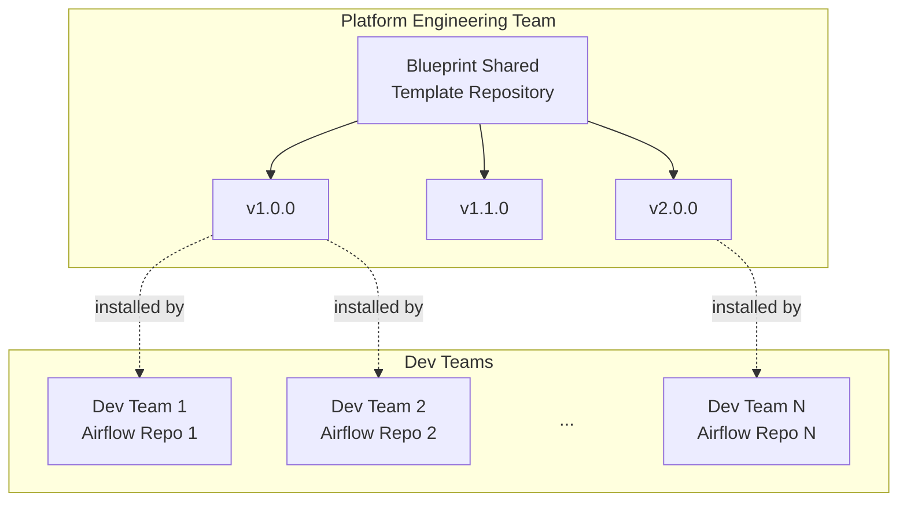

# Blueprint shared templates usage demo

This repository demonstrates usage of [Blueprint templates](https://github.com/astronomer/blueprint) installed from a package.

Installing Blueprint templates from a package is a best practice when templates are shared amongst multiple development teams, each using their own Git repository. Installing a package avoids copy/pasting code into each repository and that code getting out of sync:

This repository resembles one of the Airflow repositories, used by a dev team.

- See this example repository containing shared Blueprint templates: https://github.com/astronomer/blueprint-shared-templates-demo.
- Templates are released via a versioned package, and installed in each development team's Git repository. See [requirements.txt](requirements.txt). That ensures everybody knows which version of shared Blueprint templates is used.
- This repository only needs to install the shared Blueprint templates package. That package includes [airflow-blueprint](https://pypi.org/project/airflow-blueprint) as a dependency.
